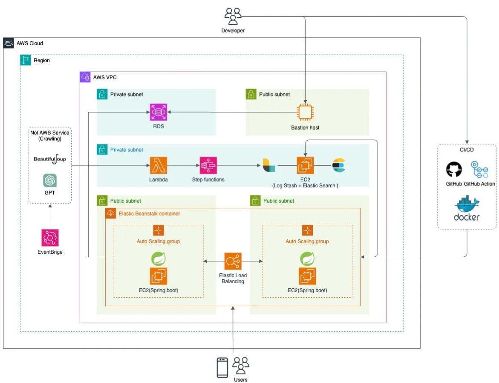

  

# INFOU (인하대 공지사항, 강의평 간편 확인 서비스)

  
<strong>&nbsp;Table of Contents</strong>

&nbsp;  
[About The Project](#about-the-project) 
[Team Members](#team-members) 
[Built With](#built-with) 
[Architecture](#aws-architecture) 
[model](#model) 

&nbsp;

<!-- ABOUT THE PROJECT -->
## About The Project

Project Duration: Jan 10, 2024 - July 06, 2024

INFOU 는 Inha Univ. 내부 강의평과 공지사항 데이터를 한눈에 확인할 수 있는 어플리케이션 서비스 입니다. 

&nbsp;

### Key Feature
- **강의평 데이터:** 수강신청 시 필수 요구되는 강의 만족도 평가를 가져옵니다.

- **공지사항 추천:** 사용자와 비슷한 학과,학년,관심도 정보를 기반으로 필요한 공지사항을 추천해줍니다.

&nbsp;

<!-- Team -->
## Team Members
* **팀장, 추천시스템 :** 전민혜, 컴퓨터공학과, Inha Univ.* 
* **Flutter (프론트):** 하성민, 경영학과, Inha Univ.
* **Java Spring (백):** 김률아, 컴퓨터공학과, Inha Univ.* 

&nbsp;

<!-- Built with -->
## Built With
   
  
  

&nbsp;

## Architecture
&nbsp;

